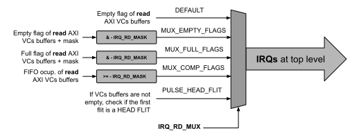
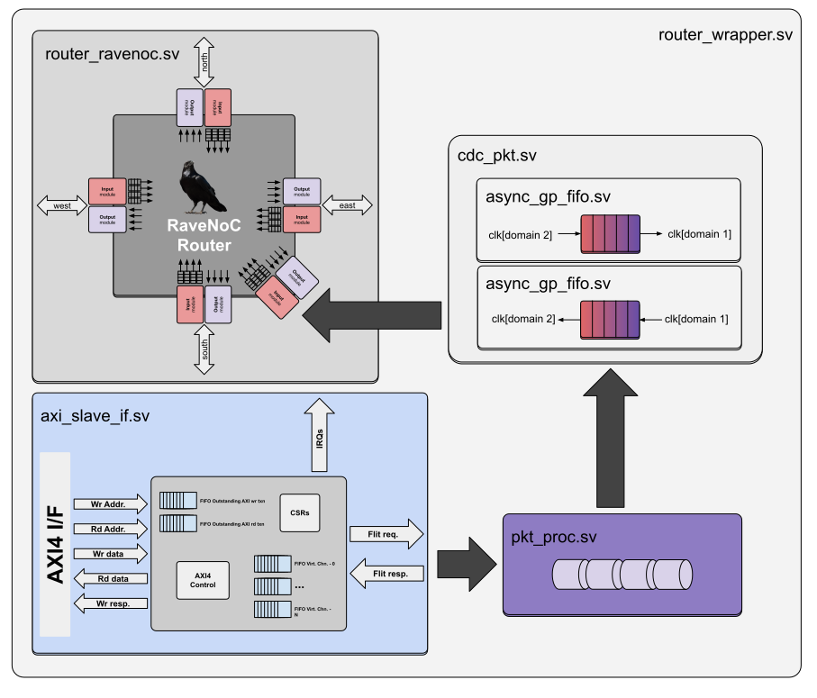
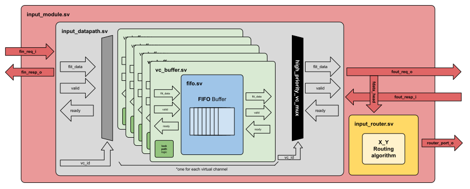
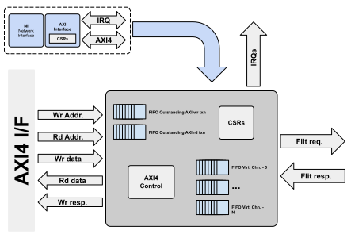

[](https://github.com/aignacio/ravenoc/actions/workflows/regression.yaml) [](https://github.com/aignacio/ravenoc/actions/workflows/lint_sv.yaml) [](https://github.com/aignacio/ravenoc/actions/workflows/lint_editor.yaml)

[](https://www.librecores.org/aignacio/ravenoc) [](https://gitter.im/aignacio/RaveNoC)


# RaveNoC - configurable Network-on-Chip
## Table of Contents
* [Quickstart regression](#quick)
* [Introduction](#intro)
* [Integration](#usg)
    * [Additional CSRs](#pluscsrs)
    * [IRQs](#irqs)
    * [Configurable parameters](#confparam)
* [RTL uArch](#uarch)
    * [Router](#router)
    * [Input module](#inmod)
    * [Output module](#outmod)
    * [Network Interface](#ni)
* [License](#lic)

## <a name="quick"></a> Quickstart regression
To run the regression tests for the NoC, please follow the sequence below:
```bash
# You should have python 3 installed to continue
# Install verilator 4.106
$ sudo apt install -y --no-install-recommends make g++ perl python3 autoconf flex bison libfl2 libfl-dev zlibc zlib1g zlib1g-dev
$ git clone https://github.com/verilator/verilator.git
$ cd verilator
$ git checkout v4.106
$ autoconf
$ ./configure
$ make -j $(nproc)
$ sudo make install
# Install tox
$ python -m pip install --upgrade pip
$ pip install tox tox-gh-actions
# Run the regression with tox
$ cd ravenoc
$ tox
```
The created `run_dir` folder has all the logs and waveforms (in fst format) for the run. To get more details of the tests please read [Tb readme](tb/README.md).

## <a name="intro"></a> Introduction
RaveNoC is a configurable HDL for mesh NoCs topology that allows the user to change parameters and setup new configurations. In summary, the features of the RaveNoC are:
1. Mesh topology (2D-XY)
2. Valid/ready flow control
3. Switching: Pipelined wormhole
4. Virtual channel flow control
5. Slave I/F AMBA AXI4
6. Different IRQs that can be muxed/masked individually
7. Configurable parameters:
    - Flit/AXI data width
    - Number of buffers in the input module
    - Number of virtual channels
    - Order of priority in the VCs
    - Dimensions of the NoC (Rows_X_Cols)
    - Routing algorithm
    - Maximum size of packets

## <a name="usg"></a> Integration
The RTL top [file](src/ravenoc.sv) exports arrays of inputs/outputs of an AXI4 slave interface that has length equals to the number of routers in the NoC i.e Rows X Cols. Also as an input parameter of **ravenoc** module, there is `AXI_CDC_REQ` array which is used to specify if each router need or not the CDC [async gp fifo](https://zipcpu.com/blog/2018/07/06/afifo.html) due to cross clock domain aspect. 

There is a single clock/async. reset for the NoC and an array of clocks/async. resets for the AXIs due to the fact that every router can have a different clock domain. An additional input called `bypass_cdc` is used in the [testbench](tb/README.md) but it is not recommended to be used during integration once if CDC is not required, the user should change the `AXI_CDC_REQ` parameter as mentioned in the specific array index.

For every router a set of CSRs (Control and Status registers) are available which can be individually programmable per unit. The list of CSRs available are:
|       CSR       |                           Address                          |             Description             | Default | Permissions |
|:---------------:|:----------------------------------------------------------:|:-----------------------------------:|:-------:|:-----------:|
| RAVENOC_VERSION |  [`AXI_CSR_BASE_ADDR](src/include/ravenoc_defines.svh)+'h0 | RaveNoC HW version                  |   1.0   |  Read-Only  |
| ROUTER_ROW_X_ID |  [`AXI_CSR_BASE_ADDR](src/include/ravenoc_defines.svh)+'h4 | Row / X - ID of the Router          |    0    |  Read-Only  |
| ROUTER_COL_Y_ID |  [`AXI_CSR_BASE_ADDR](src/include/ravenoc_defines.svh)+'h8 | Column / Y - ID of the Router       |    0    |  Read-Only  |
|  IRQ_RD_STATUS  |  [`AXI_CSR_BASE_ADDR](src/include/ravenoc_defines.svh)+'hC | Returns the IRQ value per VC        |    --   |  Read-Only  |
|    IRQ_RD_MUX   | [`AXI_CSR_BASE_ADDR](src/include/ravenoc_defines.svh)+'h10 | Controls the input mix of IRQs      | DEFAULT |     R/W     |
|   IRQ_RD_MASK   | [`AXI_CSR_BASE_ADDR](src/include/ravenoc_defines.svh)+'h14 | Controls the input mask of the IRQs |  'hFFFF |     R/W     |

See the SV structs to understand the possible values for the [**IRQ_RD_MUX**](src/include/ravenoc_structs.svh).

### <a name="pluscsrs"></a> Additional CSRs
There are some additional CSRs which are generated based on the number of **virtual channels** that the NoC is configured. Each CSR is connected to the *read pointer FIFO element* bits that indicate the size of the packet of each individual VC read FIFO. They are read-only CSRs and the start address is right after the default CSR table above. For instance, in a NoC with **4xVCs** the CSRs are the ones listed below:
|        CSR       |          Address          |        Description        | Default | Permissions |
|:----------------:|:-------------------------:|:-------------------------:|:-------:|:-----------:|
| RD_SIZE_VC_PKT_0 | [`AXI_CSR_BASE_ADDR](src/include/ravenoc_defines.svh)+'h18 | Size of the packet in VC0 |    0    |  Read-Only  |
| RD_SIZE_VC_PKT_1 | [`AXI_CSR_BASE_ADDR](src/include/ravenoc_defines.svh)+'h1C | Size of the packet in VC1 |    0    |  Read-Only  |
| RD_SIZE_VC_PKT_2 | [`AXI_CSR_BASE_ADDR](src/include/ravenoc_defines.svh)+'h20 | Size of the packet in VC2 |    0    |  Read-Only  |
| RD_SIZE_VC_PKT_3 | [`AXI_CSR_BASE_ADDR](src/include/ravenoc_defines.svh)+'h24 | Size of the packet in VC3 |    0    |  Read-Only  |

Considering the example above, to get the size of the packet in the **virtual channel 3**, the user must read the address *AXI_CSR_BASE_ADDR+'h24*.

### <a name="irqs"></a> IRQs
In the top level there is also available an array of IRQs (Interrupt Request Signals) that is a struct which is connected to every router / AXIs of the NoC. All the IRQs are related to the AXI read VC buffers of the router. Two CSRs mentioned previously are important to configure the IRQ behavior in each router. The **IRQ_RD_MUX** selects which is the input source for the IRQs, that can be either the `empty` or `full` flags of the read AXI buffers or a comparison with the number of flits available to be read at the read buffer. And the **IRQ_RD_MASK** is an input mask that does the AND logical operation with every bit of the output of IRQ_RD_MUX and in case this one is set to comparison, the mask will represent the reference value. The image below tries to explain the text:


### <a name="confparam"></a> Configurable parameters 
The following parameters are configurable and can be passed by compilation time as system verilog macros. Please check that not all parameters are indicated to change unless to look inside the code to understand how it is used or wants to build something custom for one specific application. To check which are the default values for all the parameters, see the main [defines file](src/include/ravenoc_defines.svh).
|     SV Macro    |                             Description                            |  Default Value  |                    Range                   |
|:---------------:|:------------------------------------------------------------------:|:---------------:|:------------------------------------------:|
| FLIT_DATA_WIDTH | Flit data width in bits, AXI data width will must match            |        32       |          (32,64) - 128 not tested          |
|    FLIT_BUFF    | Number of flits buffered in each virtual channel input fifo        |        2        |     (1,2,4,8...) - Must be a power of 2    |
|    N_VIRT_CHN   | Number of virtual channels                                         |        3        |           (1,2,3,4...) - Up to 32          |
|    H_PRIORITY   | Priority order on the virtual channels                             |  ZeroHighPrior  |        ZeroHighPrior or ZeroLowPrior       |
| NOC_CFG_SZ_ROWS | Number of rows in the NoC - X                                      |        2        | 1 (if cols > 1),2,3,4... - Any int. value  |
| NOC_CFG_SZ_COLS | Number of cols in the NoC - Y                                      |        2        |  1 (if rows > 1),2,3,4... - Any int. value |
|   ROUTING_ALG   | Routing algorithm of the input module                              |     "XYAlg"     |           "XYAlg" or "YXAlg"               |
|    MAX_SZ_PKT   | Max number of flits per packet                                     |       256       |                Min. val == 1               |
| AUTO_ADD_PKT_SZ | If set, NoC will auto append pkt size on the header flit           |        0        |       0 - user sets the pot size or 1      |
|  RD_AXI_BFF(x)  | Math macro to gen the the num. of buffers per RD VCs on AXI4 slave |  x<=2?(1<<x):4  |                     --                     |
|     CDC_TAPS    | Number of FIFO slots in the async gp fifo used for CDC             |        2        |         >=2 - Must be a power of 2         |

## <a name="uarch"></a> RTL micro architecture
### <a name="router"></a> Router
The NoC has been constructed in a way that most part of the modules are replicated through generate SV constructions, thus the behavior is generic and it was designed in a way that the user could reuse as much as possible in different hierarchies. Each router is composed by input modules, output modules, a NI (network interface) with one CSR bank (control and status register) and an AXI4 slave interface. The diagrams below exemplifies the modules mentioned and how many instances are used at each router.

Through each router, we have 5x output modules and 5x input modules, each one connected to another that are not from the same direction (i.e other 4x ports). One router is capable of routing a packet composed by one (single head flit) or more flits through his ports (west, east, north, south or local). The only requirement for packet payload is the **header flit**, that in RaveNoC follows the below encoding:
```bash
Max_width+2b---------------------------------------------0
| FLIT_TYPE (2b) | X_DEST | Y_DEST | PKT_WIDTH | MESSAGE |
+--------------------------------------------------------+
```
Each port will always select a router for the current flit in the correspondent virtual channel to route but never in the same direction i.e it'll never return from where it came from. This also applies to the local port (the one in diagonal in the previous diagram). So if a flit is pushed through the router it's because it has a destination valid and the flit should move in between the input modules internal FIFOs. For instance in a NoC 2x2, considering all the connections with routers we have something like this:


In the RaveNoC routers there are also some additional components which are used for assembling the packet and converting clock domains between the NoC and the AXI interface. The image below shows internally how these pieces are connected together and what is the datapath of the packet.

In the `pkt_proc`, the `flit type` is appended to the packet and send to the `cdc_pkt`. The `cdc_pkt` module is optional and not instantiated individually in each router if `AXI_CDC_REQ[router]` is set to **0**.

### <a name="inmod"></a> Input module
One router has exactly 5x input modules, each input module can have one or more [**virtual channels**](https://ieeexplore.ieee.org/document/4286853), each virtual channel has a FIFO inside that's also configurable and it's responsible to store the flits that comes from his input interface. 

The router connections of *west, east, north, south* come from another router, in the local port it comes from the **network interface** that is consuming/producing flits all the time. Every time a **head** flit arrives in the input module, the input router inside this module will decode its destination by looking to the current node address of the router and the target one in the **header flit**. 

Depending upon the chosen algorithm for the routing, it selects one of 4x possible output modules internally. There is no sequential logic latency in the data path from the input to the FIFOs, meaning that once the flit is in the input, in the next clock cycle it'll be stored in the correct FIFO. Also it's important to highlight that each virtual channel has it's own independent FIFO and when a higher priority virtual channel message comes, the **lower priority flits are preempted** inside their FIFOs, allowing only the higher priority flit pass through. 

If the FIFOs are full, each independent one will set zero the correspondent `ready` interface signal to generate back pressure on the connections in. If there is space available and the interface has `valid` asserted, then a flit will go through the input module and this module will (in the next clock cycle) forward it is route to the output.

### <a name="outmod"></a> Output module
The output module has no sequential elements like FFs to store the flits, so it means by that every time a route has been established, it will connect the correspondent FIFO input module to the next router in the NoC.

Each output module has a round-robin arbiter per virtual channel, so in a long time, it will keep fairness between the different input modules of the same virtual channel. The same concept applied in the input module of "*preemptive virtual channels*" is used in the output module, where a flit coming from a higher priority virtual channel will have precedence over the lower ones. 

Thus the input module routing is responsible for locking the current route by it's own, on each independent virtual channel, once it should be restored after the high priority flit has been transferred. 

### <a name="ni"></a> Network Interface
In each router we have also a NI - Network Interface that is the entry point for the flits in/out of the NoC. The NI has a single [AXI4](https://en.wikipedia.org/wiki/Advanced_eXtensible_Interface) slave I/F which is used by the crossbar its connected, to transmit/receive packets from the network. Also it has a dedicated I/F to talk with the **local** input module, once we need to send packets and it exports the IRQs - Interrupt Requests of the router.

Inside each NI, we have 2x FIFOs (WR/RD) for the outstanding AXI transactions (by default it is support up to 2 but can be configured as well) and *N-*FIFOs, one for each virtual channel. As the priority of the VCs is different, the user can tweak the `RD_AXI_BFF(x)` macro to define the size of each FIFO per VC, thus not all these memories will have the same length.

#### Write packets
Every time a new AXI write txn arrives at the slave I/F, it is decoded to see if the address is inside the CSR address space or if the user wants send a packet. To send a packet the user must write in the **wr buffer VCs** address space, which by default is located at `'h1000+(VC_ID*'h8)` where VC_ID is the numeric value of the VC. For instance, if the NoC has 4xVCs and the user wants to send a packet with priority equal to 2, it should write it at the address `'h1010`. The length of the AXI burst defines the size of the packet, i.e for a burst with AWLEN == 5, it means a packet with length equal to 6. In bytes this means `((AxLEN+1)*bus_width)/8`, once all writes must use full bus width.

#### Read packets
In the other way for an AXI read, it is decoded to see if the address is inside the CSR address space or if the user wants **read** a packet from the read VC buffers. For the reads, all the operations must consider the address space default `'h2000+(VC_ID*'h8)` where VC_ID is the numeric value of the VC. Similar the write example, if the NoC has 4xVCs and the user wants to read a packet with priority equal to 2, it should write it at the address `'h2010`, and as well in the write, the length of the AXI burst defines the size of the packet, i.e for a burst with ARLEN == 5, it means a packet with length equal to 6. In bytes this means `((AxLEN+1)*bus_width)/8`, once all reads must use full bus width.

## <a name="other"></a> Other info
This project uses CI to run [regression tests](.github/workflows/regression.yaml), check linting on the RTL and parse with editorconfig configuration. For the RTL linting, it is used [verible](https://google.github.io/verible/), running the [verible-verilog-lint](https://google.github.io/verible/verilog_lint.html) and for the editor config check, it is used [editorconfig-checker](https://editorconfig-checker.github.io).

## <a name="lic"></a> License
RaveNoC is licensed under the permissive MIT license.Please refer to the [LICENSE](LICENSE) file for details.
